# Expressões Regulares (RegEx)

Aplicações em...

1. Validação de formulários HTML
2. Extração de texto com JavaScript
3. Substituição de texto com JavaScript
4. Substituição de texto em múltiplos arquivos com VS Code
5. Filtragem de texto em arquivos de log no Linux

## Projeto para Playground

Esta é a tela do formulário HTML onde foram praticados os exemplos de expressões regulares.

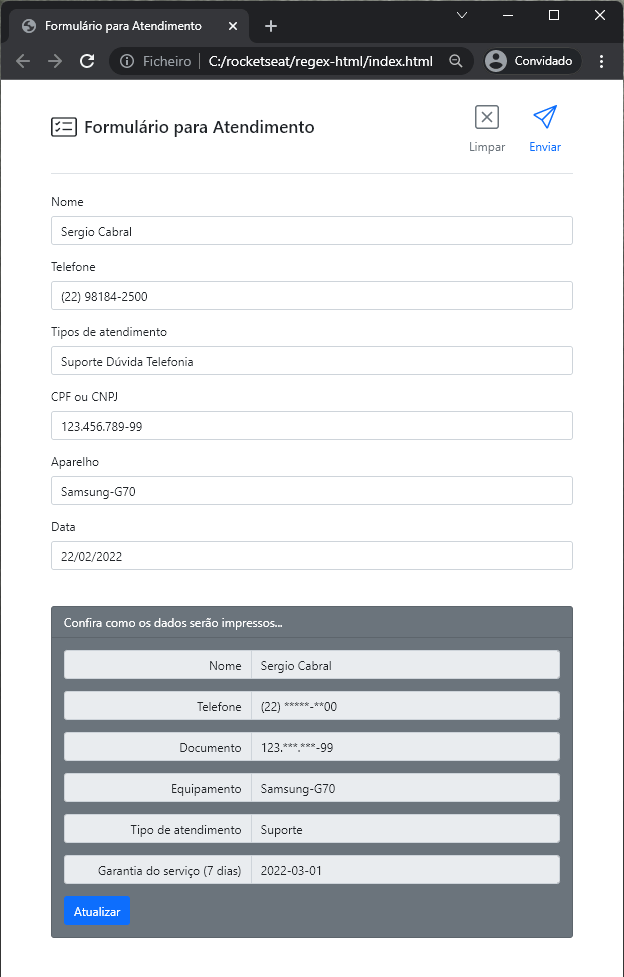

## Aprendendo e Praticando

Para aprender mais um ótimo documento em português é o manual na [developer.mozilla.org](https://developer.mozilla.org/pt-BR/docs/Web/JavaScript/Guide/Regular_Expressions).

Para praticar procure na internet por `regex online`. Mas no geral eu uso o [regex101.com](https://regex101.com/)

## Slides da aula

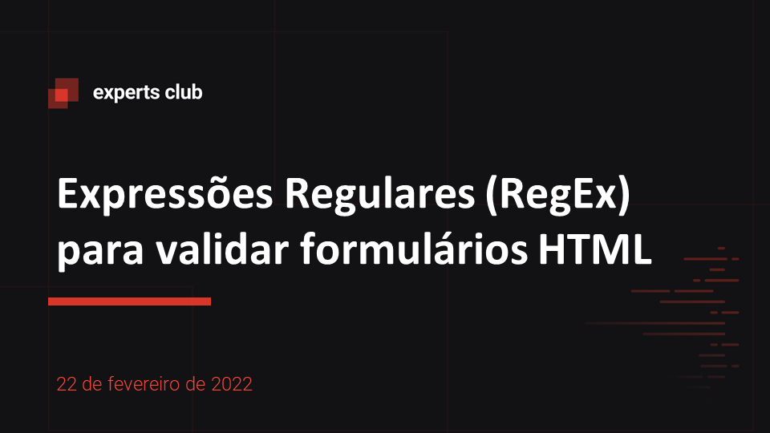

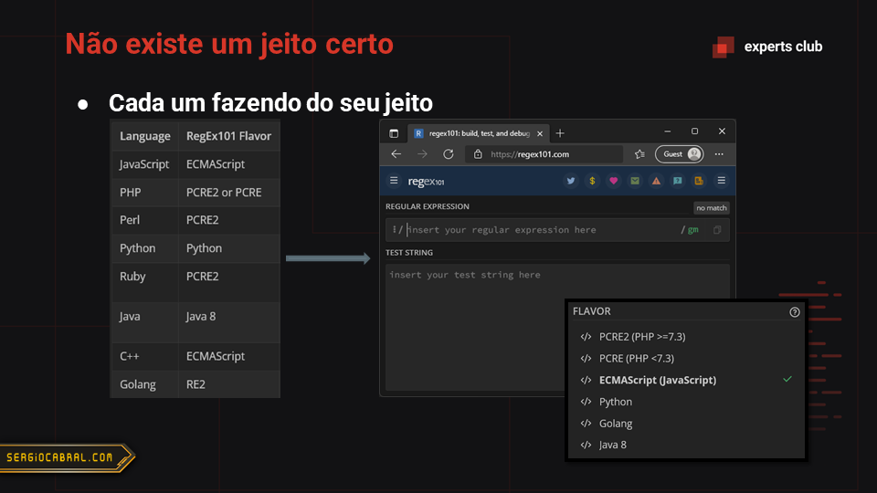

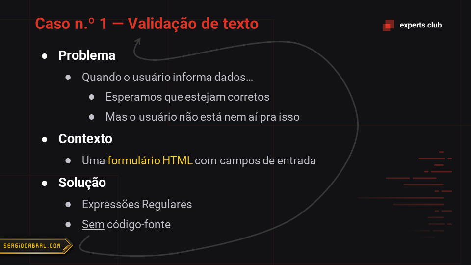

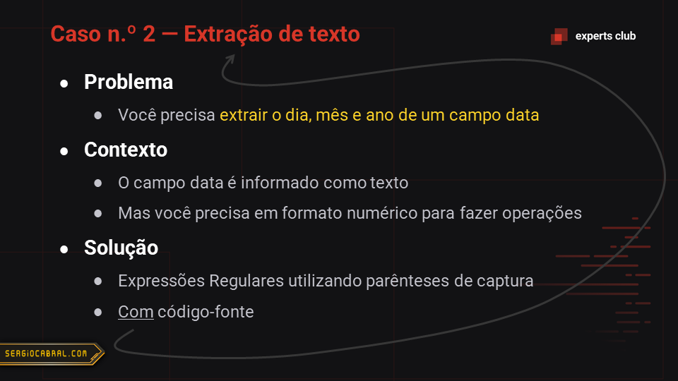

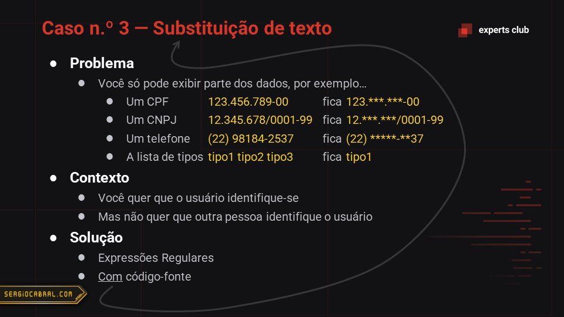

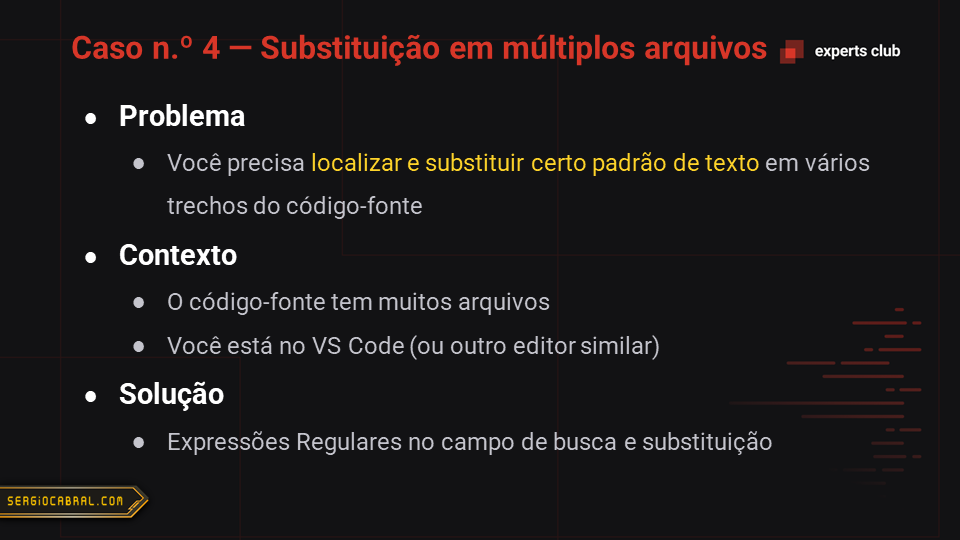

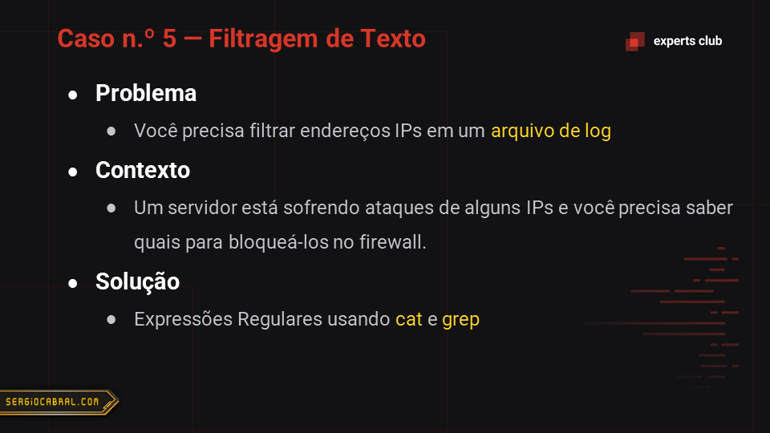

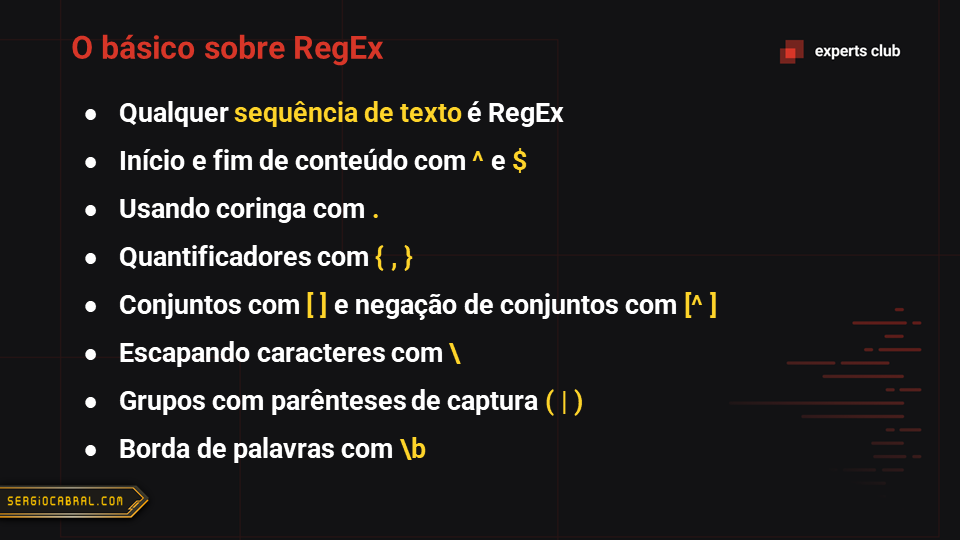

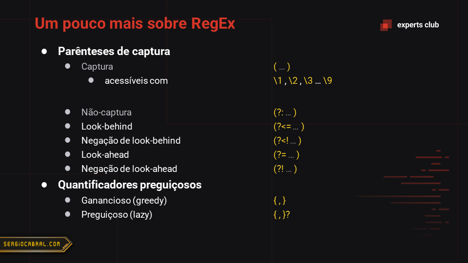

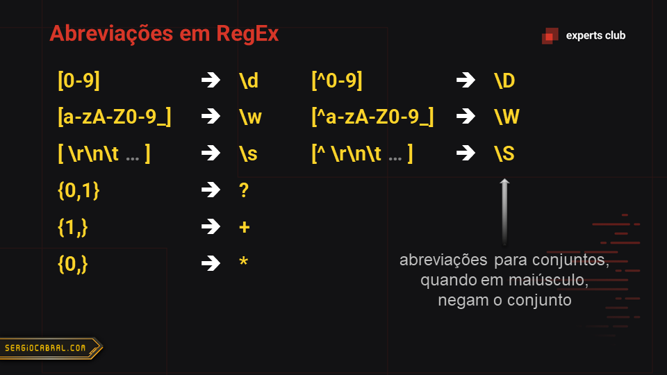

## Expert

|  |
| :-: |
|[sergiocabral.com](https://sergiocabral.com)|
